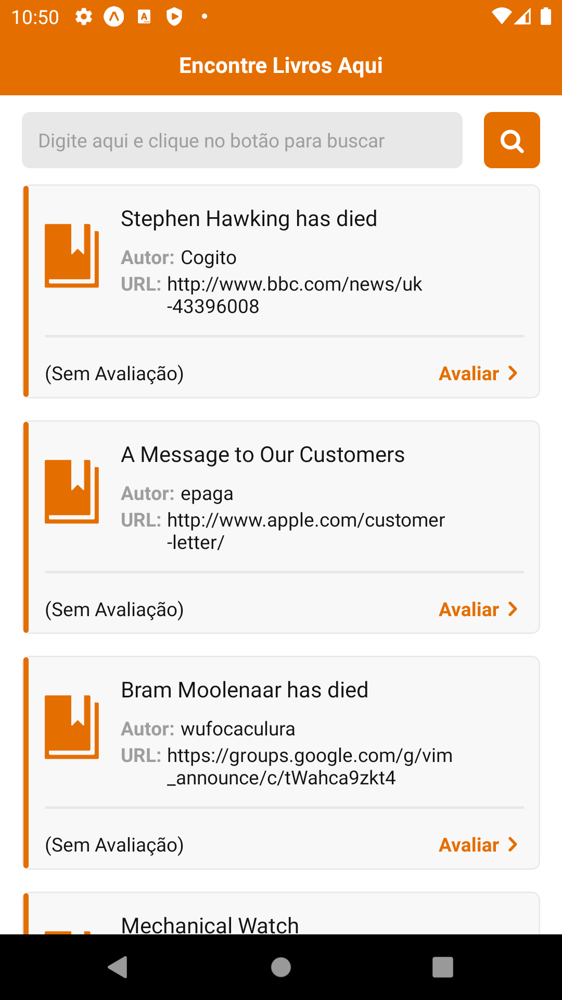
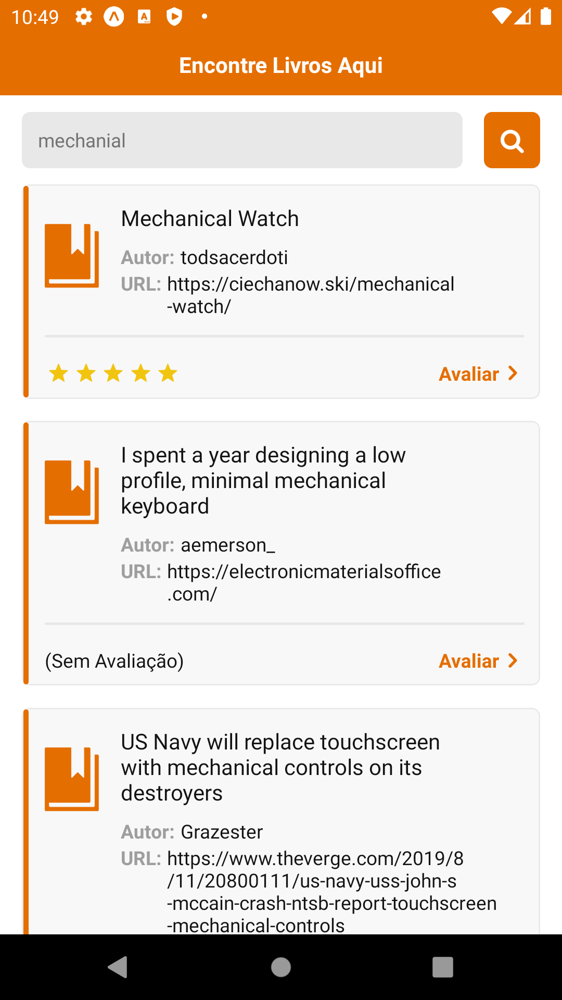

# Trabalho I - Desenvolvimento de Software para Dispositivos Móveis

A aplicação é uma app de listagem de livros desenvolvida com React Native, a qual se conecta com uma API Rest pública utilizando o protocolo HTTP. A API fornece uma rota de listagem de livros que também permite filtragem por título do livro, a qual é consumida na aplicação. Além da funcionalidade de listagem de livros, também temos a funcionalidade de busca por título do livro através de um campo de busca e a funcionalidade de adicionar avaliações nos livros.

## Telas do App:

  &nbsp;&nbsp;&nbsp;&nbsp;&nbsp;&nbsp;&nbsp;&nbsp;&nbsp;
  &nbsp;&nbsp;&nbsp;&nbsp;&nbsp;&nbsp;&nbsp;&nbsp;&nbsp;
  &nbsp;&nbsp;&nbsp;&nbsp;&nbsp;&nbsp;&nbsp;&nbsp;&nbsp;

## Preview:

## Tecnologias e bibliotecas utilizadas:

- Expo
- Typescript
- React Native
- Axios
- Expo Icons
- React Native Modalize

